# BGE-M3 Evaluation Conclusion

Based on the execution of the evaluation pipeline over the Nepal Company Act dataset (851 chunks, 110 validated queries), we can draw several important conclusions regarding the performance of the retrieval methods.

## Key Findings

> [!TIP]
> **Hybrid Retrieval is the clear winner.**
> Across all K-values (K=1, 3, 5, 7, 10), the Hybrid method (which combines Dense and Sparse scores) consistently outperforms both individual methods.

1. **Dense vs. Sparse**: 
   - **Dense Retrieval** (`BAAI/bge-m3` embeddings) performs significantly better than **Sparse Retrieval** (Lexical weights) in this specific Nepali legal domain context.
   - For example, at K=10, Dense achieves a Recall of **45.45%** compared to Sparse's **43.64%**.
2. **Top-K Impact**:
   - The majority of relevant documents are found within the Top 3 to Top 5 results.
   - Going from K=1 to K=5 improves Recall from **~36%** to **~42%** (Hybrid).
   - Going from K=5 to K=10 yields a smaller incremental gain, maxing out at **45.45%** Hit Rate / Recall for both Dense and Hybrid.
3. **Precision Trade-off**:
   - As K increases, Precision naturally drops (from 36% at K=1 down to 4.5% at K=10), because we are only looking for a single relevant document per query in the golden dataset.

---

## Visualizing Performance

Here is a visual comparison of the **Recall** and **MRR** (Mean Reciprocal Rank) metrics across the different retrieval methods.

### Recall @ K Comparison

```mermaid
xychart-beta
    title "Recall at different K values (Higher is better)"
    x-axis "K Values" ["K=1", "K=3", "K=5", "K=7", "K=10"]
    y-axis "Recall" 0.3 --> 0.46
    bar "Dense" [0.345, 0.400, 0.427, 0.436, 0.454]
    bar "Sparse" [0.327, 0.381, 0.390, 0.418, 0.436]
    line "Hybrid" [0.363, 0.409, 0.418, 0.445, 0.454]
```

### MRR @ K Comparison

```mermaid
xychart-beta
    title "Mean Reciprocal Rank at different K values (Higher is better)"
    x-axis "K Values" ["K=1", "K=3", "K=5", "K=7", "K=10"]
    y-axis "MRR Score" 0.32 --> 0.40
    bar "Dense" [0.345, 0.368, 0.375, 0.376, 0.378]
    bar "Sparse" [0.327, 0.350, 0.351, 0.356, 0.358]
    line "Hybrid" [0.363, 0.383, 0.385, 0.389, 0.390]
```

---

## Recommendations & Next Steps

> [!IMPORTANT]
> **Data Quality Insight**: The fact that the maximum Recall tops out at ~45.45% indicates that for over half the queries, the relevant document is missing from the top 10 entirely.

1. **Investigate the 55% Miss Rate**: We should inspect the queries that fail to retrieve the relevant document in the top 10. The BGE-M3 model might struggle with highly specific legal phrasing in Nepali, or the chunks might be improperly segmented.
2. **Enable the Reranker**: Once GPU access is available, enabling the `bge-reranker-v2-m3` model (by setting `SKIP_RERANKER = False`) will likely boost the MRR and NDCG scores significantly by pulling the relevant documents from the Top-100 up into the Top-5.
3. **Chunking Strategy**: The dataset has 851 chunks. Adjusting the chunk size (e.g., semantic chunking instead of strict paragraph/section chunking) might improve the context window for the dense embeddings.
